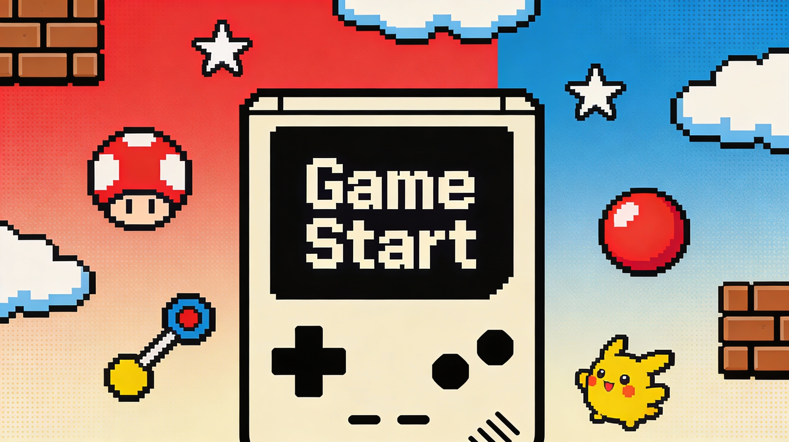

<p align="center">
  
</p>

<h1 align="center">🎮 AI-Game-Crafter</h1>

<p align="center">
  
</p>

<p align="center">
  <strong>AI-Driven Game Re-Creation & Learning Log</strong><br>
  AI와 협업하여 명작 게임을 분석하고 재창조하는 학습 저장소입니다.
</p>

<br>

---

<h2 align="center">🛠 Tech Stack</h2>
<p align="center">
  <b>Languages & Frameworks</b><br>
   (Pygame, Pyxel) &nbsp;
   (HTML Canvas, Phaser) &nbsp;
   (Unity)
</p>
<p align="center">
  <b>AI & Development Tools</b><br>
   &nbsp;
  
</p>
<br>

---

<p align="center">
  <b>🌐 Language Selection</b> <br>
  <a href="#-english-version">English</a> • 
  <a href="#-한국어-버전">한국어</a> • 
  <a href="#-日本語バージョン">日本語</a>
</p>

<br>

---


## 🇺🇸 English

### 🚀 Project Overview
Decoding legendary games and rebuilding them using modern AI capabilities. By leveraging **Gemini** and **Claude**, I aim to bridge the gap between classic game logic and AI-assisted development.

### 🌟 Project Stages (5 Levels)
* **Stage 1: Foundation** - Basic movement and text-based logic.
* **Stage 2: Interaction** - Physics, collisions, and state management.
* **Stage 3: Systems** - Advanced Enemy AI, inventory, and scene transitions.
* **Stage 4: Expansion** - Procedural generation and AI-driven dialogues.
* **Stage 5: Innovation** - Original mechanics and high-level AI behaviors.

### 🕹️ Current Projects
| Project Name            |  Level  | Status                                                                         | Details                                             |
| :---------------------- | :-----: | :----------------------------------------------------------------------------- | :-------------------------------------------------- |
| **[Super Mario Clone]** | Stage 1 |  | Environment setup & logic analysis with Gemini      |
| **[Pokemon Style RPG]** | Stage 1 |  | Architecture design & asset preparation with Claude |

<br>
<br>


---


## 🇰🇷 한국어

### 🚀 프로젝트 개요
명작 게임의 메커니즘을 해체하고 최신 AI 기술을 활용해 재구축합니다. **Gemini**와 **Claude**를 설계 파트너로 활용하여 고전 게임 로직과 AI 기반 개발 사이의 가교 역할을 하는 것을 목표로 합니다.

### 🌟 프로젝트 단계 (5단계)
* **1단계: 기초** - 캐릭터 이동 및 기초 텍스트 로직 구현.
* **2단계: 상호작용** - 물리 엔진, 충돌 감지 및 상태 관리.
* **3단계: 시스템** - 지능형 적 AI, 인벤토리 및 씬 전환 시스템.
* **4단계: 확장** - AI 기반 대화 시스템 및 절차적 맵 생성.
* **5단계: 혁신** - 독창적인 게임 메커니즘 및 고급 AI 행동 패턴 설계.

### 🕹️ 진행 중인 프로젝트
| 프로젝트명              | 레벨  | 상태                                                                         | 상세 내용                                  |
| :---------------------- | :---: | :--------------------------------------------------------------------------- | :----------------------------------------- |
| **[슈퍼 마리오 클론]**  | 1단계 |  | Gemini를 활용한 환경 설정 및 로직 분석     |
| **[포켓몬 스타일 RPG]** | 1단계 |  | Claude를 활용한 아키텍처 설계 및 에셋 준비 |

<br>
<br>

---


## 🇯🇵 日本語

### 🚀 プロジェクト概要
名作ゲームのメカニズムを解析し、最新のAI技術を活用して再構築します。**Gemini**と**Claude**を設計パートナーとして活用し、レトロゲームのロジックとAI支援開発の融合を目指します。

### 🌟 プロジェクトステージ (5段階)
* **第1段階：基礎** - キャラクターの移動と基本的なテキストロジックの実装。
* **第2段階：相互作用** - 物理エンジン、衝突判定、状態管理。
* **第3段階：システム** - 高度な敵AI、インベントリ、シーン遷移。
* **第4段階：拡張** - AIベースの対話システムと手続き型マップ生成。
* **第5段階：革新** - 独創的なゲームメカニズムと高度なAI行動設計。

### 🕹️ 現在のプロジェクト
| プロジェクト名                | レベル  | ステータス                                                                         | 詳細                                                 |
| :---------------------------- | :-----: | :--------------------------------------------------------------------------------- | :--------------------------------------------------- |
| **[スーパーマリオ クローン]** | 第1段階 |  | Geminiを活用した環境構築およびロジック分析           |
| **[ポケモンスタイル RPG]**    | 第1段階 |  | Claudeを活用したアーキテクチャ設計およびアセット準備 |

<br>
<br>


---


<h2 align="center">📂 Project Structure</h2>

```text
.
├── mario-clone/          # Super Mario Clone Project
│   ├── src/              # Source code (Python/Pygame)
│   ├── assets/           # Sprites, Sounds, Maps
│   └── LOG.md            # AI Collaboration Log (Gemini)
├── pokemon-rpg/          # Pokemon Style RPG Project
│   ├── src/              # Source code (JS/Phaser)
│   ├── data/             # Monster & Item Databases (JSON)
│   └── LOG.md            # AI Collaboration Log (Claude)
├── docs/                 # General documentation & Design notes
├── .gitignore            # Git ignore settings
├── banner.png            # Repository Banner
└── README.md             # Project Roadmap & Overview
```

### 🎓 Learning Track
* **[Coursera]** [Microsoft Python Development Professional Certificate](https://www.coursera.org/professional-certificates/microsoft-python-developer)

<br>
<br>

---

<h2 align="center">📚 References & Resources</h2>

<details open>
  <summary><b>🇺🇸 English References</b></summary>
  <ul>
    <li>📖 <a href="https://github.com/nature-of-code">The Nature of Code</a> — Fundamental physics and natural laws in games.</li>
    <li>📖 <a href="https://gameprogrammingpatterns.com/">Game Programming Patterns</a> — Design patterns for game architecture.</li>
    <li>🎥 <a href="https://www.youtube.com/@ClearCode">Clear Code</a> — Practical Python game development.</li>
    <li>🌐 <a href="https://www.pygame.org/docs/">Pygame Docs</a> — Official documentation for Python game dev.</li>
  </ul>
</details>

<details>
  <summary><b>🇰🇷 한국어 참고 자료</b></summary>
  <ul>
    <li>📖 <a href="https://github.com/nature-of-code">The Nature of Code</a> — 게임 내 물리 현상 및 자연 법칙 구현의 바이블.</li>
    <li>📖 <a href="https://gameprogrammingpatterns.com/">Game Programming Patterns</a> — 유연한 게임 구조 설계를 위한 디자인 패턴.</li>
    <li>🎥 <a href="https://www.youtube.com/@ClearCode">Clear Code</a> — 파이썬 게임 개발 실무 강의.</li>
    <li>🌐 <a href="https://www.pygame.org/docs/">Pygame Docs</a> — 파이썬 게임 개발 공식 문서.</li>
  </ul>
</details>

<details>
  <summary><b>🇯🇵 日本語の参考資料</b></summary>
  <ul>
    <li>📖 <a href="https://github.com/nature-of-code">The Nature of Code</a> — ゲームにおける物理現象と自然法則の実装。</li>
    <li>📖 <a href="https://gameprogrammingpatterns.com/">Game Programming Patterns</a> — ゲーム開発のデザインパターン。</li>
    <li>🎥 <a href="https://www.youtube.com/@ClearCode">Clear Code</a> — 実践的なPythonゲーム開発。</li>
    <li>🌐 <a href="https://www.pygame.org/docs/">Pygame Docs</a> — Pythonゲーム開発公式ドキュメント。</li>
  </ul>
</details>

